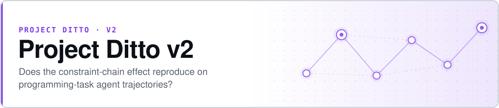

<p align="center">
  <picture>
    <source media="(prefers-color-scheme: dark)" srcset="assets/banner-dark.svg">
    
  </picture>
</p>

# Project Ditto v2

**Does the constraint-chain effect reproduce on programming work, or was it a property of Pokémon?**

Project Ditto v2 is a pre-registered replication-and-generality test. It applies the same six-type constraint-chain abstraction from [v1](https://github.com/safiqsindha/Project-Ditto) — through a new domain-specific translation function — to programming-agent trajectories from Terminal-Bench 2.0 and SWE-bench Verified. If the abstraction captures something general about sequential decision-making, the real-vs-shuffled effect should survive the domain change.

- **Generality test, not a rerun** — a different domain, a different translation function, the same frozen abstraction and the same scoring
- **Pre-registration frozen before scoring** — `SPEC.md` + immutable `SPEC.pdf`, committed 2026-04-22
- **Domain-blind rendering** — chains contain no programming vocabulary; the leakage check runs on every chain and cannot be bypassed
- **Paired inference throughout** — McNemar for Layer 1, paired *t* for Layer 2, Bonferroni across all four model × source cells


**[Pre-registration](SPEC.md)** · **[Results](RESULTS.md)** · **[Write-up](WRITEUP.md)** · **[Corrected scoring](CORRECTED_SCORING_v2.md)** · **[Architecture](CLAUDE.md)**

```bash
pip install -r requirements.txt
python -m src.runner --model haiku --source swe --chains chains/real/swe/ --seed 42 --dry-run --n 5
```

## Headline result: the abstraction partially reproduces

Across **1,186 real chains** and **21,348 matched pairs**, on Claude Haiku 4.5 and Sonnet 4.6 at three temperature/seed configurations:

| Layer | Criterion | Outcome |
|---|---|---|
| **Layer 2** — legality × optimality | Secondary | **Clears on all four cells.** Gap 0.049–0.088, paired *t* *p* ≪ 0.001 in every case |
| **Layer 1** — top-3 next-action match | Primary | **Mixed.** Haiku on Terminal-Bench clears the minimum publishable threshold (gap 0.0801, Bonferroni *p* = 0.0116); the other three cells do not |

Direction is positive in **7 of 8** primary cells. The honest reading is partial transfer: the effect is real on programming telemetry but substantially weaker than on v1's Pokémon chains, and it does not clear the primary criterion uniformly.

> Three scorer versions exist and are additive — no file was modified. Primary results use `src/scorer_corrected_v2.py`, which requires **both** the real and the shuffled chain to be actionable. See [`CORRECTED_SCORING_v2.md`](CORRECTED_SCORING_v2.md) for why that filter was adopted.

## Data sources

| Source | Trajectories | Real chains | Gate 3 | Gate 4 |
|---|---:|---:|---|---|
| Terminal-Bench 2.0 + extras | 4,258 | **170** | PASS | PASS (100%) |
| SWE-bench Verified | 5,000 | **1,016** | PASS | PASS (100%) |
| Human sessions (SpecStory) | in progress | pending | pending | pending |

Gate 5 (live API dry-run): **PASS**.

## How it works

Agent trajectories — shell commands, file edits, test runs — are compressed into events, then translated by **T-code** into six typed constraints capturing resource budgets, tool availability, sub-goal transitions, information state, coordination dependencies, and optimization criteria. Chains render into domain-blind abstract English, then real chains are compared against seeded shuffled controls. The model is asked to predict the next constraint at a mid-chain cutoff; higher accuracy on real than on shuffled is the effect.

```
data/<source>/trajectories.jsonl
  → scripts/acquire_<source>.py       HuggingFace / GitHub acquisition
  → src/parser_<source>.py            → TrajectoryLog
  → src/aggregation.py                event compression
  → src/translation.py                T-code: events → Constraints        [FROZEN]
  → src/observability.py              asymmetric information reveal
  → src/filter.py                     is_valid_chain()
  → src/renderer.py                   abstract English + leakage check    [FROZEN]
  → src/shuffler.py                   seeded shuffled control variants
chains/real/<source>/*.jsonl  ·  chains/shuffled/<source>/*.jsonl
  → src/reference.py                  StateSignature → action distribution
  → src/runner.py                     Batches API evaluation
  → src/scorer.py                     Layer 1/2/3 scoring
results/scored.json
```

**T-code is frozen** at tag `T-code-v1.0-frozen`. Changing `src/translation.py`, `src/aggregation.py`, or `src/renderer.py` after that tag is a pre-registration violation.

### Abstract label conventions

| Domain entity | Abstract label |
|---|---|
| File paths | `file_A` … `file_Z` (overflow `file_OVERFLOW_N`) |
| Command names | `command_1` … `command_26` |
| Error types | `error_class_A` … `error_class_Z` |
| Sub-task phases | `exploration` · `hypothesis` · `implementation` · `validation` · `debugging` |

## Evaluation parameters

| Parameter | Value |
|---|---|
| Models | Claude Haiku 4.5 (`claude-haiku-4-5-20251001`), Claude Sonnet 4.6 (`claude-sonnet-4-6`) |
| Seeds | 42 (T=0.0, primary) · 1337 and 7919 (T=0.5, variance study) |
| Cutoff | K = `len(constraints) // 2` |
| API | Anthropic Messages Batches (50% cost reduction) |

## Quick start

```bash
pip install -r requirements.txt

# Build chains from acquired data
python scripts/build_chains.py --source swe --data data/swe_bench_verified/ \
  --out-real chains/real/swe/ --out-shuffled chains/shuffled/swe/ --gate3

# Build and verify the reference distribution
python -m src.reference build-raw --source swe --raw chains/real/swe/ --out data/reference_swe.pkl
python -m src.reference check --dist data/reference_swe.pkl --chains chains/real/swe/ --target 0.9

# Dry-run, then the full evaluation
python -m src.runner --model haiku --source swe --chains chains/real/swe/ --seed 42 --dry-run --n 5
python scripts/run_evaluation.py

pytest tests/
```

## Key files

| File | Purpose |
|---|---|
| [`SPEC.md`](SPEC.md) / [`SPEC.pdf`](SPEC.pdf) | Pre-registered methodology and thresholds (frozen) |
| [`RESULTS.md`](RESULTS.md) | Full results write-up |
| [`WRITEUP.md`](WRITEUP.md) | Narrative paper draft |
| [`SUPPLEMENTARY.md`](SUPPLEMENTARY.md) | Supplementary analyses |
| [`VERIFICATION_REPORT.md`](VERIFICATION_REPORT.md) | Independent verification pass |
| [`CLAUDE.md`](CLAUDE.md) | Architecture, session protocol, invariants |
| [`SESSION_LOG.md`](SESSION_LOG.md) | Per-session engineering log |

## Scope

v2 has **no synthetic-data fallback** — unlike v1, if real data is unavailable the run stops rather than substituting generated trajectories. Scoring runs in a separate blinded session that reads only `results/blinded/`. Pre-registered thresholds are never adjusted to match observed results.

## The Ditto program

| Version | Domain | Headline |
|---|---|---|
| [v1](https://github.com/safiqsindha/Project-Ditto) | Pokémon Showdown telemetry | Sonnet +0.206 · Haiku +0.066 |
| **v2** ⟵ *you are here* | **Programming agent trajectories** | **Partial reproduction** |
| [v3](https://github.com/safiqsindha/Project-Ditto-V3) | Chess · Chess960 · checkers · draughts | Phase 1 complete, paused at Gate 8 |
| [v4](https://github.com/safiqsindha/Project-Ditto-V4) | Pokémon, as a methodology control | +0.131, strong-positive |
| [v4.5](https://github.com/safiqsindha/Ditto-V4.5--DeepSeek-Flash-test) | DeepSeek V4 Flash cross-model probe | Scoping stub |
| [v5](https://github.com/safiqsindha/Ditto-V5) | PUBG · NBA · CS:GO · Rocket League · poker | 4-tier hierarchy, closed |
| [v5.1](https://github.com/safiqsindha/Ditto-5.1) | 22-model cross-provider panel | Near-chance across the panel |
| [v5.2](https://github.com/safiqsindha/Ditto-5.2-diagostic) | Diagnostic kit for the v5.1 null | Pre-registered, in progress |
| [v5.4](https://github.com/safiqsindha/DITTO-V5.4-OLAT) | 24 inference levers, two DeepSeek models | 6 meaningful conditions |

## License

[MIT](LICENSE) — free to use, modify, and distribute.
